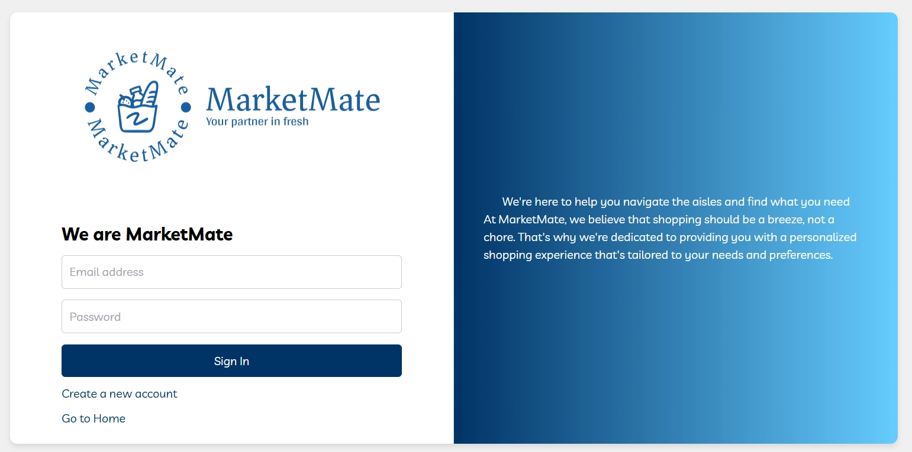
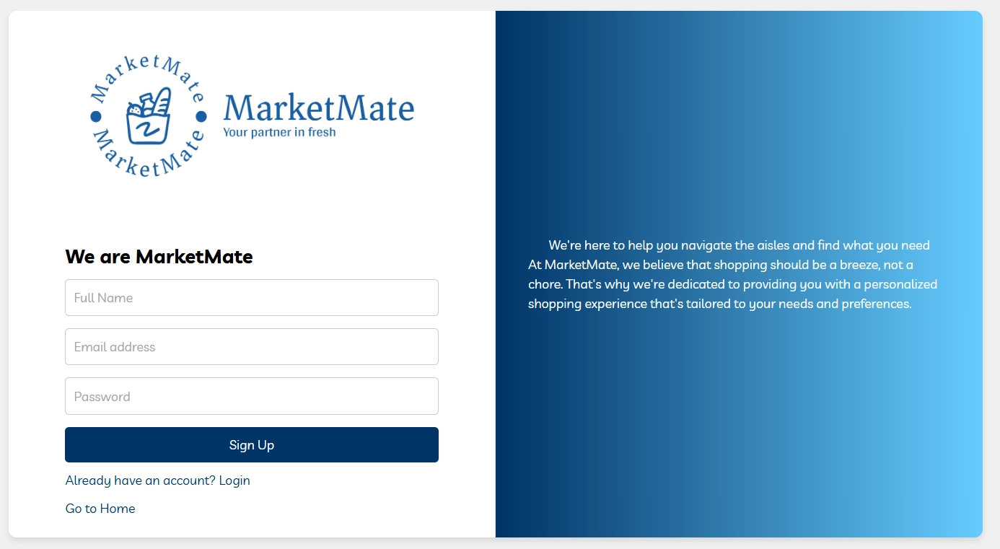
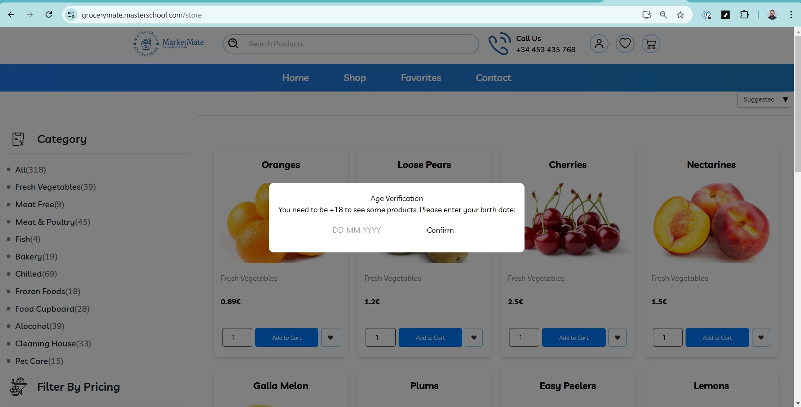

# 1. Hausaufgabe - XPath

In dieser Hausaufgabe wirst du **XPath** für verschiedene Webelemente schreiben. Verwende das **Portfolio-Repository**, um die Aufgaben einzureichen.

Erstelle für jede Aufgabe eine **`.md`-Datei** (z. B. `xpath_task_1.md, xpath_task_2.md`) und schreibe die XPath-Ausdrücke darin. Stelle sicher, dass du **nach jeder Aufgabe committest** und in dein Repository pushst.

> **Abbildungen (Aufgabe 2):** In der Aufgabenstellung auf der Kursseite sind **drei** Abbildungen vorgesehen — im Repo als **`assets/image1.webp`**, **`image2.webp`**, **`image3.webp`** (gleiche Reihenfolge). Die folgenden Teilaufgaben (**`/store`** inkl. Modal **„Confirm“** sowie **Shop** / **Oranges**) sind **ohne weiteres Bild** formuliert; dort die Seite **live im Browser** nutzen. Details: **`assets/README.md`**.

## Aufgabe 1

In dieser Aufgabe musst du **XPaths auf Grundlage des gegebenen HTML-Dokuments** schreiben. Gehe das HTML-Dokument sorgfältig durch. Du kannst den HTML-Code auch lokal **kopieren/einfügen**, um die Webseite anzuzeigen.

Hier ist das gegebene HTML:

```python
<!DOCTYPE html>
<html lang="en">
<head>
    <meta charset="UTF-8">
    <meta name="viewport" content="width=device-width, initial-scale=1.0">
    <title>Nested Complex HTML Document</title>
</head>
<body>
    <header>
        <h1 id="mainTitle">Welcome to Our Company</h1>
        <nav>
            <ul>
                <li><a href="#home" class="nav-link">Home</a></li>
                <li><a href="#about" class="nav-link">About Us</a></li>
                <li>
                    <a href="#services" class="nav-link">Services</a>
                    <ul class="dropdown">
                        <li><a href="#webdev">Web Development</a></li>
                        <li><a href="#graphicdesign">Graphic Design</a></li>
                        <li><a href="#seo">SEO Services</a></li>
                    </ul>
                </li>
                <li><a href="#contact" class="nav-link">Contact</a></li>
            </ul>
        </nav>
    </header>
    <main>
        <section id="about">
            <h2 class="sectionTitle">About Us</h2>
            <div class="content">
                <p>We are a leading company in the industry.</p>
                <div class="team">
                    <h3>Our Team</h3>
                    <ul>
                        <li>
                            <h4>John Doe</h4>
                            <p>CEO</p>
                        </li>
                        <li>
                            <h4>Jane Smith</h4>
                            <p>CTO</p>
                        </li>
                    </ul>
                </div>
            </div>
        </section>
        <section id="services">
            <h2 class="sectionTitle">Our Services</h2>
            <div class="service-list">
                <div class="service-item">
                    <h3>Web Development</h3>
                    <p>Creating stunning websites.</p>
                </div>
                <div class="service-item">
                    <h3>Graphic Design</h3>
                    <p>Designing visual content.</p>
                </div>
                <div class="service-item">
                    <h3>SEO Services</h3>
                    <p>Improving search engine rankings.</p>
                </div>
            </div>
        </section>
        <section id="contact">
            <h2 class="sectionTitle">Contact Us</h2>
            <form id="contactForm">
                <label for="name">Name:</label>
                <input type="text" id="name" required>
                <label for="email">Email:</label>
                <input type="email" id="email" required>
                <label for="message">Message:</label>
                <textarea id="message" placeholder="Your Message"></textarea>
                <input type="submit" value="Send Message">
            </form>
        </section>
    </main>
    <footer>
        <p>&copy; 2023 Company Name. All rights reserved.</p>
    </footer>
</body>
</html>
```

1. Schreibe das XPath, um das Haupt-**h1**Element zu finden.
2. Schreibe das XPath, um den Navigationslink **About Us** auszuwählen.
3. Schreibe das XPath, um den Dropdown-Link **Graphic Design** auszuwählen.
4. Schreibe das XPath, um den Namen des Teammitglieds **Jane Smith** auszuwählen.
5. Schreibe das XPath, um die Beschreibung (die sich im Absatz befindet) der **SEO Services** auszuwählen.
6. Schreibe einen XPath-Ausdruck, um alle Service-Elemente im Abschnitt "**Our Services**" auszuwählen.
7. Wie lautet das XPath, um das **E-Mail-Eingabefeld** im Kontaktformular auszuwählen?
8. Wie würdest du ein XPath schreiben, um das **gesamte Kontaktformular** auszuwählen?
9. Gib das XPath an, um das **Footer-Absatz-Element** auszuwählen.
10. Was ist das XPath, um den Namen (`<h4>`) des **ersten Teammitglieds** auszuwählen?
11. Wie kannst du mit XPath die Beschreibung des **zweiten Service-Elements** auswählen?
12. Was ist das XPath, um die Überschrift der Sektion **"Contact Us"** (`<h2>`Element) auszuwählen?
13. Schreibe einen XPath-Ausdruck, um alle Links innerhalb des Dropdowns unter dem Navigationspunkt **"Services"** auszuwählen.
14. Was ist das XPath, um das erste `<li>` im Abschnitt **"Our Team"** auszuwählen?
15. Gib das XPath an, um die Schaltfläche **"Send Message"** im Kontaktformular zu finden.

## Aufgabe 2

Gehe zu [https://grocerymate.masterschool.com](https://grocerymate.masterschool.com/)

1. Schreibe das XPath für das im untenstehenden Bild hervorgehobene Symbol/den hervorgehobenen Button.
    
    

1. Öffne nun https://grocerymate.masterschool.com/auth.
    
    

Schreibe das **XPath** für **alle Eingabefelder**, die **"Sign In"**-Schaltfläche, den Link **"Create a new account"** und den Link **"Go to Home"**.

1. Klicke nun auf denselben Link wie in Teil 2 auf **"Create a new account"**, dann wirst du die folgende Benutzeroberfläche sehen:



Schreibe das **XPath** für **alle Eingabefelder** und die **"Sign Up"**-Schaltfläche.

1. Gehe zu https://grocerymate.masterschool.com/store, dann wirst du die folgende Benutzeroberfläche sehen:

Schreibe das **XPath** der **"Confirm"**-Schaltfläche, die du im Modal sehen kannst.

1. Gehe zur **Shop**Seite und schreibe das **XPath** für das **Mengeneingabefeld von Oranges**, die **"Add to cart"**Schaltfläche für Oranges und die **"Add to wish list"**Schaltfläche für Oranges.
